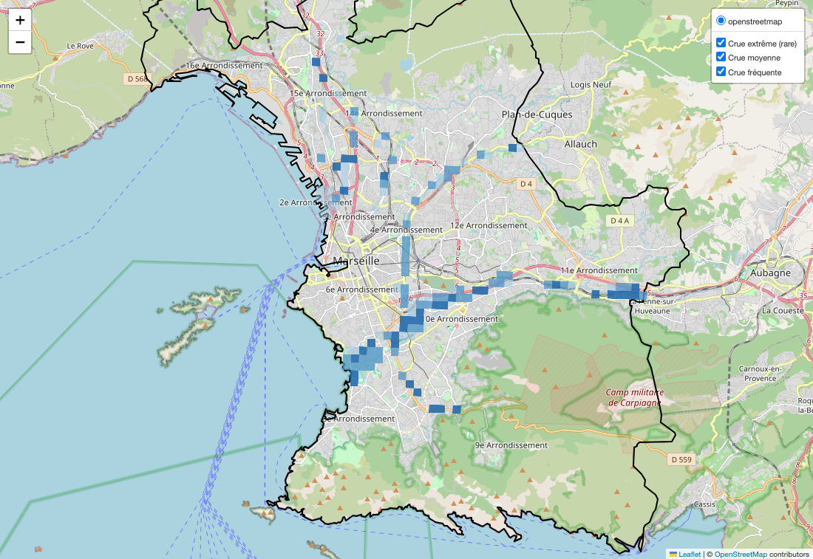
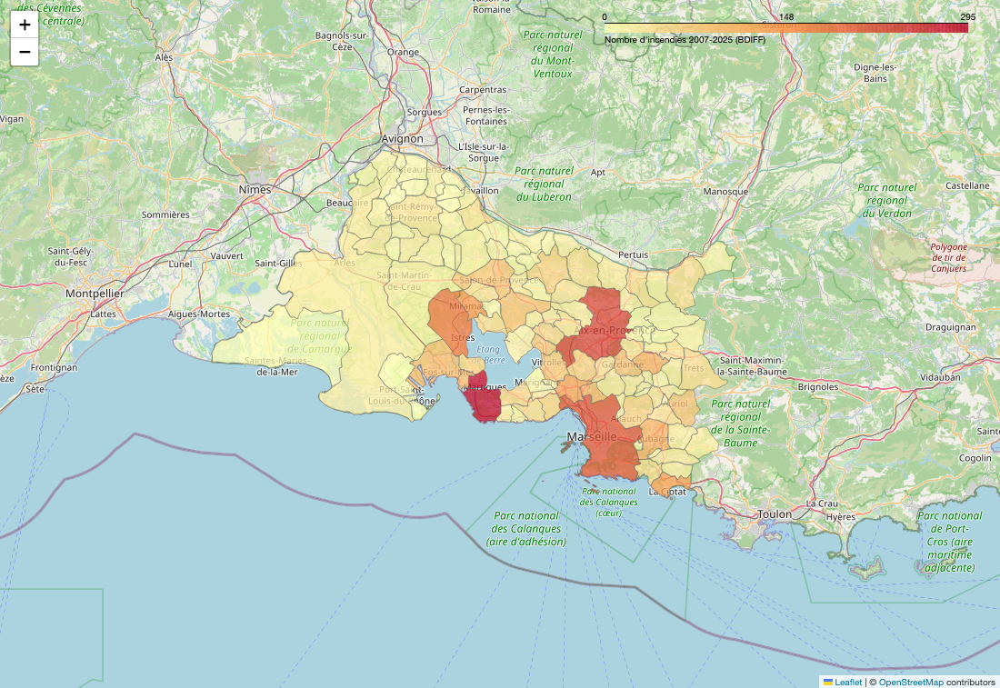

# Objectives

Deux cartes web interactives (folium) sur les risques naturels, à partir de
données publiques réelles. La géométrie (maillage, point-dans-polygone, index
spatial) est codée à la main.

Les deux aléas ne sont **pas fusionnés** : ils n'ont pas la même échelle, les
mélanger n'aurait pas de sens. Chacun a sa carte, à l'échelle où sa donnée
existe vraiment.

## Les deux cartes

- **Inondation — à l'intérieur d'une commune (Marseille).** Les zones inondables
  du TRI sont spatiales : on découpe la commune en mailles carrées et on regarde,
  pour chaque scénario de crue (fréquente / moyenne / extrême), quelles mailles
  sont inondées. La carte a donc 3 couches qu'on peut afficher séparément ; elles
  sont emboîtées (l'extrême englobe la fréquente).
- **Incendie — entre communes (département 13).** La BDIFF ne localise pas les
  feux dans une commune : impossible de différencier deux quartiers. On change
  donc d'échelle et on colore les 119 communes du département selon leur nombre
  de feux 2007-2025. Là, la donnée est différenciante (Martigues, Marseille et
  les communes boisées ressortent).

## Aperçu

Inondation de Marseille (3 scénarios de crue, ici tous affichés) :



Incendies par commune sur le département 13 (Martigues et Marseille en tête) :



Ces images sont des captures des cartes HTML, générées par
`tools/rendu_png.py` (Chrome sans fenêtre). Les vraies cartes restent
interactives : ouvrir les fichiers HTML.

## Méthode

- **Index spatial** : Marseille compte ~5000 polygones inondables ; les ranger
  dans une grille de cases de 1 km évite de tester chaque maille contre tous.
- **Simplification** : le contour de commune (~23 000 points) et les zones
  côtières sont allégés à ~30-50 m, sans effet visible à l'échelle de la grille.
- Inondation : coordonnées en Lambert 93 (mètres) pour le calcul, reprojetées en
  lon/lat (pyproj) pour l'affichage. Incendie : contours de communes déjà en
  lon/lat (API publique).

## Setup

```bash
python -m venv .venv
source .venv/bin/activate
pip install -r requirements.txt
```

## Données

- **Inondation** : zonages TRI 2020 du département 13, sur
  [GeoRisques](https://www.georisques.gouv.fr/). Volumineux (~900 Mo), **non
  versionné** (voir `.gitignore`) → à télécharger dans `data/tri_2020_sig_di_13/`.
- **Incendie** : export CSV de la [BDIFF](https://bdiff.agriculture.gouv.fr/)
  (dépt 13, feux de forêt, 2007-2025) → à télécharger dans `data/Incendies.csv`.
- **Contours de communes** : récupérés une fois sur
  [geo.api.gouv.fr](https://geo.api.gouv.fr/) et mis en cache dans
  `data/communes_13.geojson`.

## Usage

```bash
cd src
python3 main.py             # -> carte_inondation.html  (Marseille)
python3 carte_incendies.py  # -> carte_incendies.html   (département 13)
```

Ouvrir les fichiers HTML dans un navigateur. GitHub n'affiche pas les cartes
interactives : il faut les ouvrir localement.

Pour régénérer les aperçus PNG (nécessite `selenium` + Chrome) :

```bash
python3 tools/rendu_png.py   # -> assets/*.png
```

## Tests

```bash
python3 tests/test_geometrie.py
```

## Structure

```
.
├── src/
│   ├── geometrie.py        # boîte englobante, point-dans-forme, simplification
│   ├── grille.py           # maillage carré de la commune
│   ├── donnees.py          # lecture shapefiles (pyshp) + CSV BDIFF
│   ├── risque.py           # index spatial + test d'inondation par scénario
│   ├── carte_inondation.py # carte inondation, 3 couches (folium + pyproj)
│   ├── main.py             # pipeline inondation
│   └── carte_incendies.py  # carte incendie par commune (dépt 13)
├── tools/
│   └── rendu_png.py        # capture les cartes HTML en PNG (Chrome headless)
├── assets/                 # les PNG affichés dans ce README
├── tests/
│   └── test_geometrie.py
└── data/
    ├── Incendies.csv          # BDIFF (versionné)
    ├── communes_13.geojson    # contours communes (cache, versionné)
    └── tri_2020_sig_di_13/    # zonages TRI (non versionné, ~900 Mo)
```

## Notes

- Changer de commune (inondation) : ajuster `COMMUNE` et le TRI dans `main.py`
  (la commune doit être couverte par le TRI choisi).
- Idées d'améliorations possibles : mailles plus fines, aléa feu de forêt spatial
  (PPRIF / occupation du sol) pour différencier l'incendie DANS une commune.
